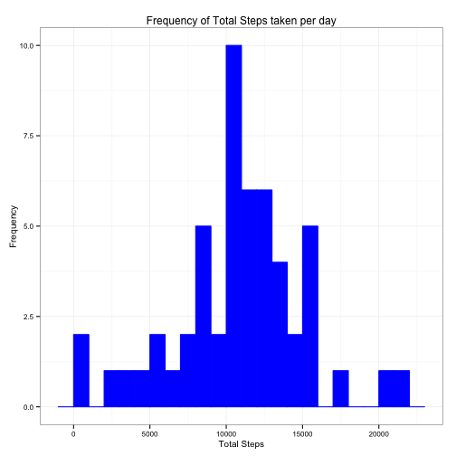
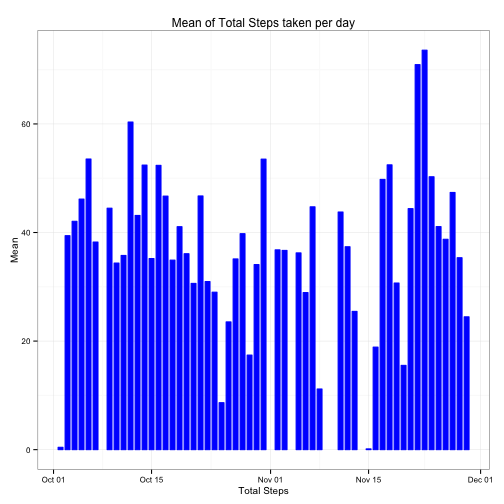
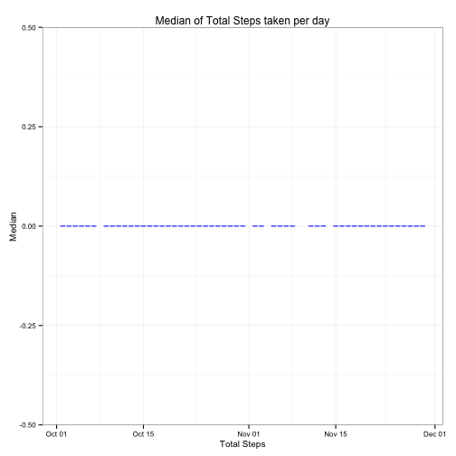
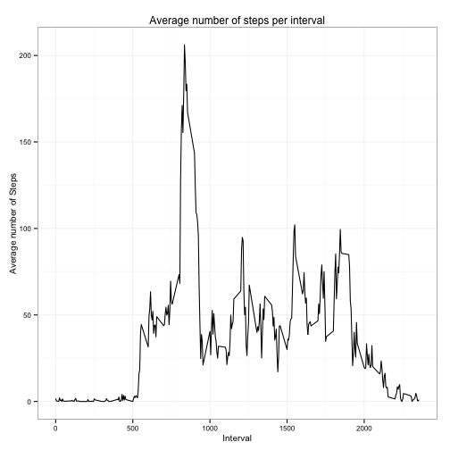
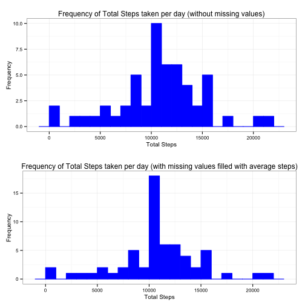
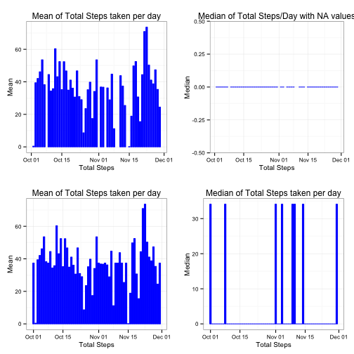
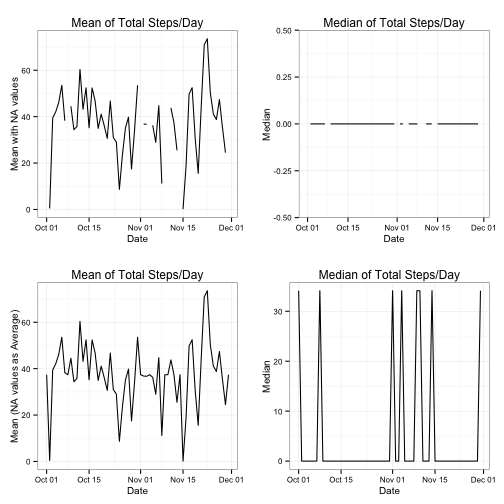
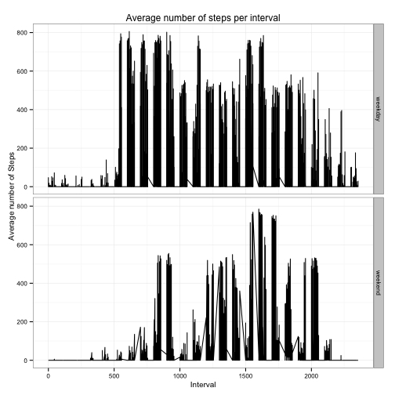

# Reproducible Research: Peer Assessment 1


## Loading and preprocessing the data

```r
library(ggplot2)
dat <- read.csv("activity.csv")
completeDat <- dat[complete.cases(dat), ]
```


## What is mean total number of steps taken per day?


```r
### Make a histogram of the total number of steps taken each day
totalStepsDat <- aggregate(steps ~ date, completeDat, sum)
m <- ggplot(totalStepsDat, aes(x = steps)) + theme_bw(base_size = 10) + labs(title = "Frequency of Total Steps taken per day", 
    x = "Total Steps", y = "Frequency") + geom_histogram(binwidth = 1000, colour = "blue", 
    fill = "blue")
m
```

 

```r

### Calculate the mean and median for total number of steps taken per day

meanStepsDat <- aggregate(steps ~ date, completeDat, mean)
meanStepsDat$date <- as.Date(meanStepsDat$date)
m <- ggplot(meanStepsDat, aes(date, steps)) + theme_bw(base_size = 10) + labs(title = "Mean of Total Steps taken per day", 
    x = "Total Steps", y = "Mean") + geom_bar(colour = "blue", fill = "blue", 
    width = 0.7, stat = "identity")
m
```

 

```r
# m <- ggplot(meanStepsDat, aes(x=steps)) + labs(title='Frequency of Mean
# Steps taken per day', x='Mean Steps', y='Frequency') +
# geom_histogram(binwidth=10, colour = 'blue', fill = 'blue') m

medianStepsDat <- aggregate(steps ~ date, completeDat, median)
medianStepsDat$date <- as.Date(medianStepsDat$date)
m <- ggplot(medianStepsDat, aes(date, steps)) + theme_bw(base_size = 10) + labs(title = "Median of Total Steps taken per day", 
    x = "Total Steps", y = "Median") + geom_bar(colour = "blue", fill = "blue", 
    width = 0.7, stat = "identity")
m
```

 

```r
# m <- ggplot(medianStepsDat, aes(x=steps)) + labs(title='Frequency of Mean
# Steps taken per day', x='Median Steps', y='Frequency') +
# geom_histogram(binwidth=1, colour = 'blue', fill = 'blue') m

### * Assuming single value of mean and median is expected as the result
### mean(totalStepsDat$steps) median(totalStepsDat$steps)
```


## What is the average daily activity pattern?


```r
### Make a time series plot (i.e. type = 'l') of the 5-minute interval
### (x-axis) and the average number of steps taken, averaged across all days
### (y-axis)
averageStepsByIntervalDat <- aggregate(steps ~ interval, completeDat, mean)
m <- ggplot(averageStepsByIntervalDat, aes(interval, steps)) + geom_line() + 
    labs(title = "Average number of steps per interval", x = "Interval", y = "Average number of Steps") + 
    theme_bw(base_size = 10)
m
```

 

```r

### Which 5-minute interval, on average across all the days in the dataset,
### contains the maximum number of steps?
averageStepsByIntervalDat[order(averageStepsByIntervalDat$steps, decreasing = TRUE), 
    ][1, ]
```

```
##     interval steps
## 104      835 206.2
```


## Imputing missing values

```r
### Calculate and report the total number of missing values in the dataset
### (i.e. the total number of rows with NAs)
nrow(dat[!complete.cases(dat), ])
```

```
## [1] 2304
```

```r

### Devise a strategy for filling in all of the missing values in the dataset.
### The strategy does not need to be sophisticated. For example, you could use
### the mean/median for that day, or the mean for that 5-minute interval, etc.
fillMissingStepsFunction <- function(x, averageStepsByIntervalDat) {
    steps <- x[1]
    date <- x[2]
    interval <- as.integer(x[3])  # for some reason interval values gets converted to character type, so had to cast it as integer
    
    # print(class(interval))
    
    # print(paste(steps, date, interval, sep=','))
    if (is.na(steps)) {
        # print(averageStepsByIntervalDat[averageStepsByIntervalDat$interval == 0,])
        # print(averageStepsByIntervalDat[averageStepsByIntervalDat$interval ==
        # interval,])
        x[1] <- averageStepsByIntervalDat[averageStepsByIntervalDat$interval == 
            interval, 2]
    }
}

### Create a new dataset that is equal to the original dataset but with the
### missing data filled in.
filledDat <- dat
filledDat[is.na(filledDat$steps), 1] <- apply(dat[is.na(filledDat$steps), ], 
    1, fillMissingStepsFunction, averageStepsByIntervalDat)

### Make a histogram of the total number of steps taken each day

# function to plot multiple ggplot on same page, ref:
# http://www.cookbook-r.com/Graphs/Multiple_graphs_on_one_page_(ggplot2)/
multiplot <- function(..., plotlist = NULL, file, cols = 1, layout = NULL) {
    require(grid, quietly = TRUE)
    
    # Make a list from the ... arguments and plotlist
    plots <- c(list(...), plotlist)
    
    numPlots = length(plots)
    
    # If layout is NULL, then use 'cols' to determine layout
    if (is.null(layout)) {
        # Make the panel ncol: Number of columns of plots nrow: Number of rows
        # needed, calculated from # of cols
        layout <- matrix(seq(1, cols * ceiling(numPlots/cols)), ncol = cols, 
            nrow = ceiling(numPlots/cols))
    }
    
    if (numPlots == 1) {
        print(plots[[1]])
        
    } else {
        # Set up the page
        grid.newpage()
        pushViewport(viewport(layout = grid.layout(nrow(layout), ncol(layout))))
        
        # Make each plot, in the correct location
        for (i in 1:numPlots) {
            # Get the i,j matrix positions of the regions that contain this subplot
            matchidx <- as.data.frame(which(layout == i, arr.ind = TRUE))
            
            print(plots[[i]], vp = viewport(layout.pos.row = matchidx$row, layout.pos.col = matchidx$col))
        }
    }
}

totalStepsDat <- aggregate(steps ~ date, completeDat, sum)
m <- ggplot(totalStepsDat, aes(x = steps)) + theme_bw(base_size = 10) + labs(title = "Frequency of Total Steps taken per day (without missing values)", 
    x = "Total Steps", y = "Frequency") + geom_histogram(binwidth = 1000, colour = "blue", 
    fill = "blue")

totalStepsDat2 <- aggregate(steps ~ date, filledDat, sum)
m2 <- ggplot(totalStepsDat2, aes(x = steps)) + theme_bw(base_size = 10) + labs(title = "Frequency of Total Steps taken per day (with missing values filled with average steps)", 
    x = "Total Steps", y = "Frequency") + geom_histogram(binwidth = 1000, colour = "blue", 
    fill = "blue")

multiplot(m, m2, cols = 1)
```

 

```r

### Calculate and report the mean and median total number of steps taken per
### day.
meanStepsDat <- aggregate(steps ~ date, completeDat, mean)
meanStepsDat$date <- as.Date(meanStepsDat$date)
m <- ggplot(meanStepsDat, aes(date, steps)) + theme_bw(base_size = 10) + labs(title = "Mean of Total Steps taken per day", 
    x = "Total Steps", y = "Mean") + geom_bar(colour = "blue", fill = "blue", 
    width = 0.7, stat = "identity")

meanStepsDat2 <- aggregate(steps ~ date, filledDat, mean)
meanStepsDat2$date <- as.Date(meanStepsDat2$date)
m2 <- ggplot(meanStepsDat2, aes(date, steps)) + theme_bw(base_size = 10) + labs(title = "Mean of Total Steps taken per day", 
    x = "Total Steps", y = "Mean") + geom_bar(colour = "blue", fill = "blue", 
    width = 0.7, stat = "identity")

medianStepsDat <- aggregate(steps ~ date, completeDat, median)
medianStepsDat$date <- as.Date(medianStepsDat$date)
m3 <- ggplot(medianStepsDat, aes(date, steps)) + theme_bw(base_size = 10) + 
    labs(title = "Median of Total Steps/Day with NA values", x = "Total Steps", 
        y = "Median") + geom_bar(colour = "blue", fill = "blue", width = 0.7, 
    stat = "identity")

medianStepsDat2 <- aggregate(steps ~ date, filledDat, median)
medianStepsDat2$date <- as.Date(medianStepsDat2$date)
m4 <- ggplot(medianStepsDat2, aes(date, steps)) + theme_bw(base_size = 10) + 
    labs(title = "Median of Total Steps taken per day", x = "Total Steps", y = "Median") + 
    geom_bar(colour = "blue", fill = "blue", width = 0.7, stat = "identity")

multiplot(m, m2, m3, m4, cols = 2)
```

 

```r

# meanStepsDat2$steps - meanStepsDat$steps
names(meanStepsDat)[2] = "mean1"
names(meanStepsDat2)[2] = "mean2"

mergedMeanStepsDat <- merge(meanStepsDat, meanStepsDat2, all = TRUE)
# mergedMeanStepsDat[is.na(mergedMeanStepsDat$mean1), 'mean1'] <- 0
mergedMeanStepsDat$meanDiff <- mergedMeanStepsDat$mean2 - mergedMeanStepsDat$mean1

# m <- ggplot(mergedMeanStepsDat, aes(date), na.rm=F) + theme_bw(base_size =
# 10) + labs(title='Mean of Total Steps taken per day', x='Date', y='Mean')
# + geom_line(aes(y=mean1, color = 'NA as 0')) + geom_line(aes(y=mean2,
# color = 'NA as Average'))
m <- ggplot(mergedMeanStepsDat, aes(date), na.rm = TRUE) + theme_bw(base_size = 10) + 
    labs(title = "Mean of Total Steps/Day", x = "Date", y = "Mean with NA values") + 
    geom_line(aes(y = mean1))

m2 <- ggplot(mergedMeanStepsDat, aes(date), na.rm = TRUE) + theme_bw(base_size = 10) + 
    labs(title = "Mean of Total Steps/Day", x = "Date", y = "Mean (NA values as Average)") + 
    geom_line(aes(y = mean2))

names(medianStepsDat)[2] = "median1"
names(medianStepsDat2)[2] = "median2"

mergedMedianStepsDat <- merge(medianStepsDat, medianStepsDat2, all = TRUE)
# mergedMedianStepsDat[is.na(mergedMedianStepsDat$median1), 'median1'] <- 0
mergedMedianStepsDat$medianDiff <- mergedMedianStepsDat$median2 - mergedMedianStepsDat$median1

m3 <- ggplot(mergedMedianStepsDat, aes(date), na.rm = TRUE) + theme_bw(base_size = 10) + 
    labs(title = "Median of Total Steps/Day", x = "Date", y = "Median") + geom_line(aes(y = median1))

m4 <- ggplot(mergedMedianStepsDat, aes(date), na.rm = TRUE) + theme_bw(base_size = 10) + 
    labs(title = "Median of Total Steps/Day", x = "Date", y = "Median") + geom_line(aes(y = median2))

# m3 <- ggplot(mergedMeanStepsDat, aes(date), na.rm=T) + theme_bw(base_size
# = 10) + labs(title='Diff of Mean Total Steps taken per day between NA and
# filled values', x='Date', y='Mean Diff') + geom_line(aes(y = meanDiff))

# m4 <- ggplot(mergedMedianStepsDat, aes(date), na.rm=T) +
# theme_bw(base_size = 10) + labs(title='Diff of Median Total Steps taken
# per day between NA and filled values', x='Date', y='Median Diff') +
# geom_line(aes(y = medianDiff))

multiplot(m, m2, m3, m4, cols = 2)
```

```
## Warning: Removed 2 rows containing missing values (geom_path).
## Warning: Removed 2 rows containing missing values (geom_path).
```

 


### Do these values differ from the estimates from the first part of the assignment? What is the impact of imputing missing data on the estimates of the total daily number of steps?

There is impact on both mean and median results. It has minor impact on mean results as it fills in the average of all available days for days that only NA values are available, which potentially allows those days to be included in other calculations, but it greatly affects the median results as it's fills with average value for a particular day, which median value will be calculated from the average value, instead of including multiple 0, similar to other steps/days as provided by the original dataset. (Median for non-NA days are typically 0 due to multiple 0 steps entries, whereas NA days's steps are filled using the average which is not 0 and typically > 30 steps per day)

## Are there differences in activity patterns between weekdays and weekends?


```r
### Create a new factor variable in the dataset with two levels -- 'weekday'
### and 'weekend' indicating whether a given date is a weekday or weekend day.
weekDayEndDat <- dat
weekDayEndDat$weekDayEnd <- as.POSIXlt(weekDayEndDat$date)$wday

assignWeekDayEnd <- function(x) {
    weekDayEndValue = ""
    if (as.POSIXlt(x[2])$wday <= 5) {
        weekDayEndValue = "weekday"
    } else {
        weekDayEndValue = "weekend"
    }
    weekDayEndValue
}
weekDayEndDat$weekDayEnd <- apply(weekDayEndDat, 1, assignWeekDayEnd)

### Make a panel plot containing a time series plot (i.e. type = 'l') of the
### 5-minute interval (x-axis) and the average number of steps taken, averaged
### across all weekday days or weekend days (y-axis).

# averageStepsByWeekDayEndDayDat <- aggregate(steps ~ interval,
# weekDayEndDat, mean)
m <- ggplot(weekDayEndDat[complete.cases(weekDayEndDat), ], aes(interval, steps), 
    group = weekDayEnd, na.rm = TRUE) + labs(title = "Average number of steps per interval", 
    x = "Interval", y = "Average number of Steps") + theme_bw(base_size = 10) + 
    geom_line() + facet_grid(weekDayEnd ~ .)
m
```

 

